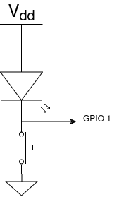
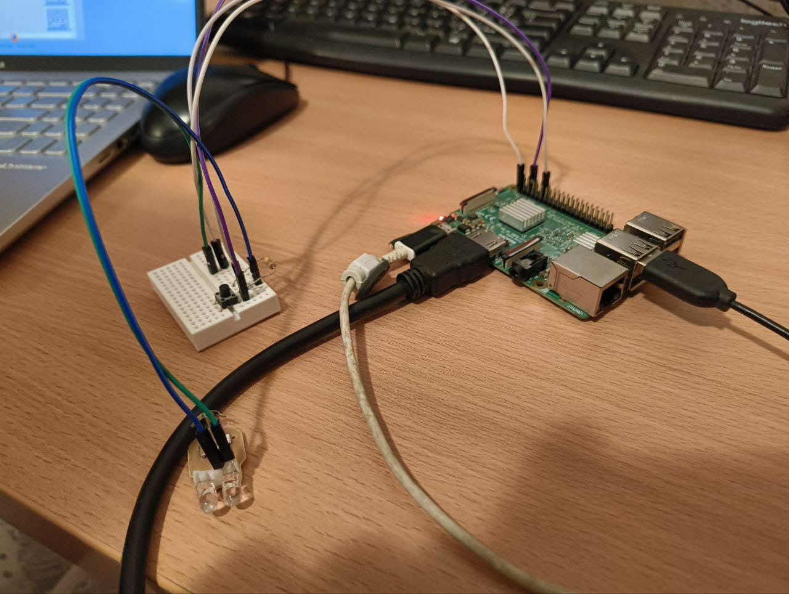
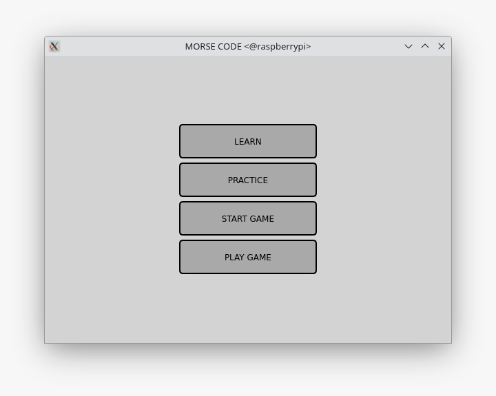
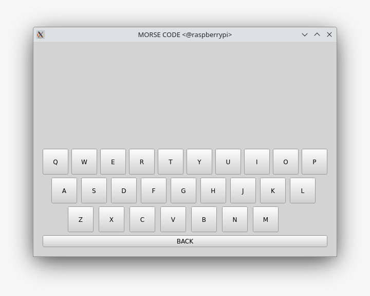
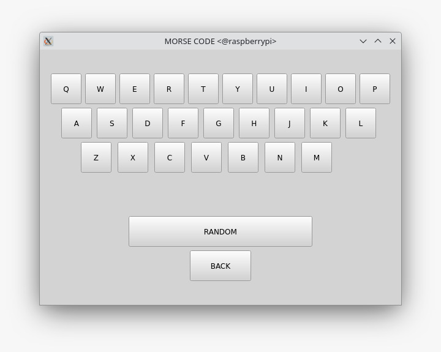
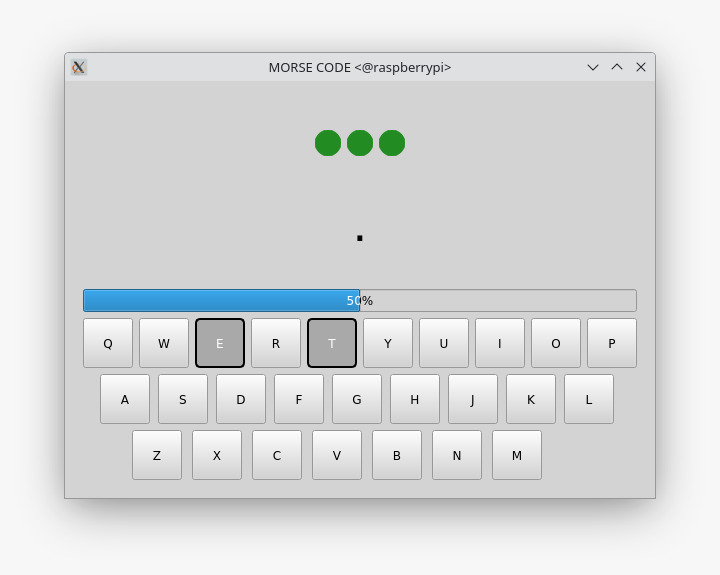
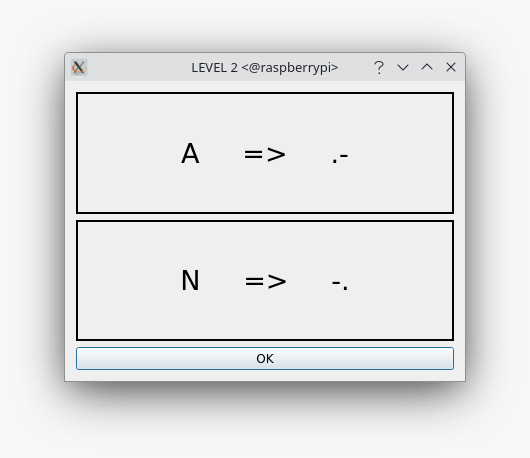
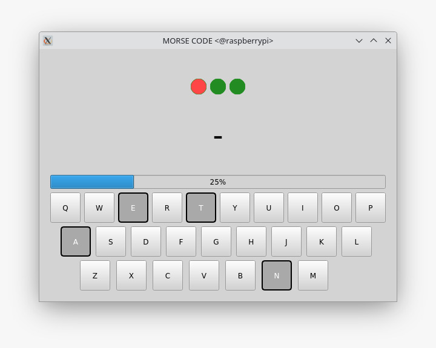
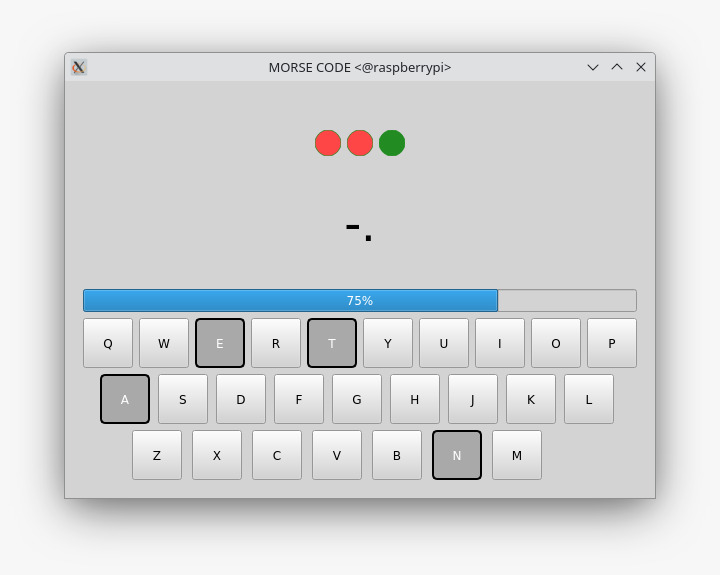
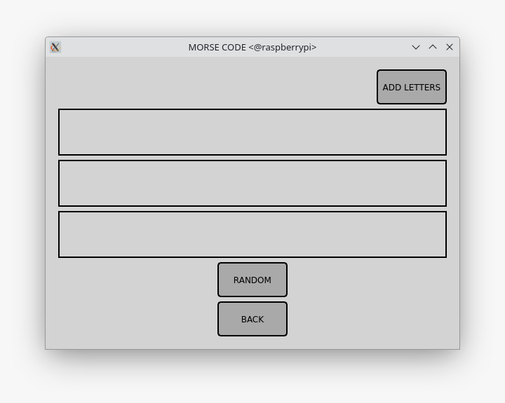

# Aplikacija za interaktivno učenje Morzovog koda

## Uvod

Tema projekta je realizacija softvera za učenje Morzovog koda kao i realizacija hardverske podrške za očitavanje unosa Morzovog koda. Kao platforma je korišćen Raspberry Pi 3B. Projekat je realizovan u Qt Creator-u u C++ programskom jeziku.

## Teorijske osnove

### Raspberry Pi 3B

Raspberry Pi 3B je razvojna ploča sa sistemom na čipu BCM2837 kompanije Broadcom. 
Ova razvojna ploca pruža: 
* USB 
* HDMI
* Ethernet 
* 40-pinski GPIO port za povezivanje sa dodatnim komponentama

### Qt radni okvir

Qt 5 je multiplatformski radni okvir koji omogućava kreiranje aplikacija sa grafičkim korisničkim interfejsom (GUI). 

## Hardver

Standardna prekidačka logika koristi PULL UP otpornik koji štiti kolo od kratkog spoja kada je prekidač zatvoren. U ovom slučaju LED dioda ima dvostruku ulogu:
* zaštita kola od kratkog spoja
* svetlosna signalizacija Morzovih simbola

## Realizacija softvera

### Glavni prozor

Glavni prozor aplikacije sadrži četiri dugmeta (*QPushButton*), svaki od njih otvara prozor koji pruža drugačiji pristup učenju Morzovog koda.

### Prozor za ucenje

Prozor za učenje je relaizovan pomoću funkcije koja generise *push buttone* u obliku tastature. Za generisanje dugmadi korišćeno je više vertikalnih *QVBoxLayout-ova,* koji su zatim smešteni u jedan zajednički horizontalni *QHBoxLayout*. Ovaj pristup omogućava manipulaciju rasporedom i izgledom prozora. Prozor za učenje koristi signal-slot mehanizam za uspostavljanje veze između pritiska na dugme i prikazivanja odgovarajućeg Morzovog koda za izabrano slovo. Na taj način, korisnici mogu lako pregledati Morzov kod za svako slovo pre nego što pređu na takmičarski deo aplikacije.

## Prozor za vežbanje

Cilj prozora za vežbanje je da korisnicima omogući vežbanje prepoznavanja Morzovog koda kroz interaktivno testiranje. Prozor je realizovan korišćenjem funkcije za generisanje dugmadi u obliku tastature, gde svako dugme predstavlja jedno slovo.  Nakon što se nasumično generiše slovo, korisnik pokušava da odabere tačan Morzov kod klikom na odgovarajuće dugme.

Sistem koristi *QMap* u kojoj su sva slova alfabeta definisana kao ključevi, dok je za svaki ključ pridružen odgovarajući Morzov kod. Kada korisnik klikne dugme, njegov odgovor se proverava u odnosu na nasumično odabrano slovo. Ako je odgovor tačan, generiše se novo slovo, a u suprotnom, ostaje isto sve dok korisnik ne pogodi ispravan Morzov kod. Takođe, dugme za nasumičnu promenu omogućava korisniku da u bilo kojem trenutku generiše novo slovo.

## Prozor sa nivoima

### QStackedWidget

U prozoru sa nivoima aplikacije korišćen je *QStackedWidget*, pri čemu svaki nivo predstavlja poseban *widget* . Ubacivanjem svakog *level widgeta* u *QStackedWidget* omogućeno je dinamičko prebacivanje između nivoa kada korisnik ispuni uslove za prelazak. Ovim je obezbeđen neprimetan prelazak između nivoa jer *widget* novog nivoa zauzima oblik *widgeta* prethodnog nivoa.

### QDialog

Na svakom sledećem nivou dodaju se po dva slova. Nakon prelaska u sledeći nivo, pojavljuje se *QDialog* sa informacijama o novim slovima koja se uvode u sledeći nivo.

Prednost korišćenja *QDialog* u ovom slucaju je što on funkcioniše kao modalni prozor. Kada se QDialog otvori, on blokira interakciju sa drugim delovima aplikacije, čime se osigurava da korisnici ne propuste neizostavne informacije za nivo koji započinju.

### Vidzet kruga

U aplikaciji je implementiran novi *widget* *CircleWidget* za vizuelno prikazivanje broja preostalih života korisnika. Ovaj element omogućava korisnicima da lako prate svoj napredak i broj preostalih pokušaja u igri. Kada korisnik izgubi tri života, *QStackedWidget* će ponovo učitati trenutni *widget* nivoa, nakon čega se osvajeni bodovi nuliraju.

### Pracenje napretka

U aplikaciji su postavljeni uslovi za prelazak u sledeći nivo, koji uključuju postizanje pet tačnih odgovora za svako slovo, pri čemu se računaju i negativni poeni. Kako bi se korisnicima olakšalo praćenje njihovog napretka, implementiran je *QProgressBar*.
*QProgressBar* vizuelno prikazuje napredak igrača, omogućavajući mu da vidi koliko je slova kompletirao sa pet tačnih odgovora.

## Prozor za igru

Poslednji prozor aplikacije uključuje dugme koje je hardverski implementirano i služi za slanje Morzovog koda. Ovaj fizički taster omogućava korisnicima da interaguju sa aplikacijom na intuitivan način, oponašajući realne uslove korišćenja Morzovog koda. Kada korisnik pritisne dugme, signal se šalje aplikaciji, koja tumači pritisak kao signalizaciju određenog slova u Morzovom kodu. Ova integracija hardverskog tastera omogućava realističnije učenje i praktikovanje Morzovog koda.

### QElapsedTimer

Logika za slanje Morzovog koda se temelji na razlikovanju dva znaka: tačke (.) i crte (-), što je određeno dužinom vremena tokom kojeg korisnik drži taster pritisnutim. Ova funkcionalnost se postiže korišćenjem klase *QElapsedTimer*, koja meri vreme između dva događaja — pritiska (*pressed*) i puštanja (*released*) tastera.

*QElapsedTimer* omogućava precizno merenje prolaznog vremena. 
Kada korisnik pusti taster, *QElapsedTimer* se koristi za izračunavanje trajanja pritiska i na osnovu tog vremena se odlučuje da li je unet znak tačka ili crta.

### QTimer

 *QTimer* koji se pokreće nakon svakog puštanja tastera. Ovaj tajmer meri vreme neaktivnosti, omogućavajući aplikaciji da odredi da li korisnik još uvek unosi slovo ili je završio unos. Ako je vreme neaktivnosti duže od određenog praga(600ms), može se smatrati da je unos završen i uslediće provera tačnosti unosa u odnosu na randomizovano slovo.

 ## Mogucnosti za unapredjenje

 ### Vise korisnickih naloga

  Implementacija mogućnosti za kreiranje i upravljanje više korisničkih naloga omogućila bi različitim korisnicima da prate njihov napredak i rezulatate.To bi takođe omogućilo različite nivoe postavki za svaki nalog.

### Debaunsiranje tastera
  Implementacija debaunsiranja tastera može značajno poboljšati preciznost učitavanja koda koji korisnik šalje. Može se primeniti softverska ili hardverska implementacija.

  

