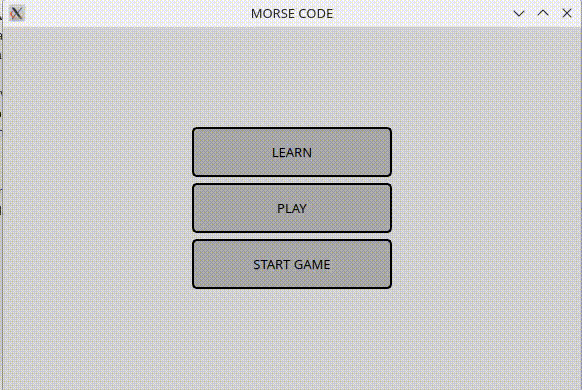
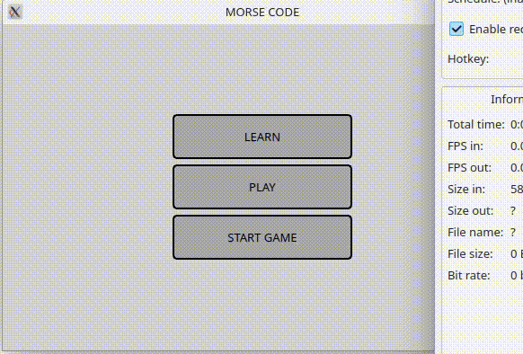

### Morse code

## Play game button
ideja projekta je interaktivno ucenje morsovog koda.

Na prvom gifu sam pokusala da prikazem kako izgleda igranje igrice odnosno prelazak izmedju nivoa. 
1.Sa pocetne strane se klikom na dugme start game pokrece igra. Prvi nivo obuhvata samo slova E i T (na pocetku svakog nivoa se pojavljuje prozor koji daje informacije o novim slovima na tom nivou)
2. Uslovi za prelazak u sledeci nivo su da svako slovo sa nivoa bude pogodjeno tacno 5 puta, ukoliko dodje do greske broj bodova se smanjuje i korisnik je korak nazad do prelaska u sledeci nivo
3. Na svaki pogresan odgovor se gubi jedan zivot koji je predstavljen sa tri zelena kruga u vrhu prozora. Ako korisnik izgubi sva tri zivota njegovi bodovi se nuliraju za taj nivo i nivo krece iz pocetka.
4. Ukoliko korisnik predje u novi nivo iskocice prozor sa informacijama o nova dva slova koja se uvode i dugmad sa tim slovima ce sada postati dostupna i povezana.
5. Pravila za svaki sledeci nivo su jednaka.

## Learn button

Prilikom pritiska na learn button otvara se prozor koji sadrzi dugmad sa svim slovima alfabeta. Cilj ovog dela aplikacije je da uvek budu dostupna sva slova i njihova interpretacija morsovim kodom. Odnosno da korisnik ne mora da stigne do 4. nivoa kako bi naucio kako se kodira slovo M. Pritiskom na svako dugme se u labeli iznad tastature pojavljuje adekvatan kod u odnosu na dugme koje je pritisnuto odnosno slovo.

## Play button

Prilikom pritiska na play button prozor izgleda dosta slicno kao prethodni. Njegova ideja je da korisnik uvek moze da vezba sva slova (a ne da prelazi nivoe) tako sto ce pritiskom na random button generisati morsov kod u labeli iznas. Zadatak korisnika je da klikom na odgovarajuce dugme odgovori koje je slovo u pitanju. Ukoliko korisnik pogresi dobice informaciju o tome i u labeli ce se opet naci isti kod (dok ne pogodi ili ne odluci da ponovo randomizuje). U slucaju kada korisnik tacno odgovori dobi ce informaciju o tome i nakon nekoliko sekundi ce se randomizovati novi kod. Cilj ovog prozora je vezba i nije takmicarkog duha.

